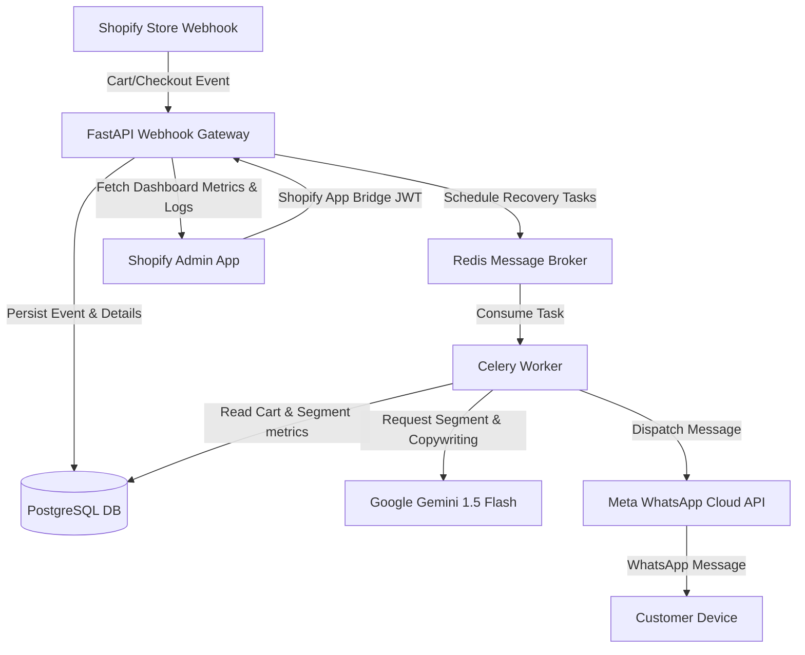

# RecoverFlow AI — Shopify Abandoned Cart Recovery Platform

RecoverFlow AI is a production-ready, automated e-commerce revenue recovery platform. It integrates with **Shopify Webhooks**, runs a background orchestration pipeline via **FastAPI & Celery**, uses **Google's Gemini 1.5 Flash model** for customer segmentation & dynamic copywriting, and dispatches highly targeted messages via **Meta's WhatsApp Cloud API**.

---

## 🚀 Key Features

*   **AI-Driven Customer Segmentation:** Automatically classifies customers into 6 distinct cohorts (`VIP`, `HIGH_VALUE`, `DISCOUNT_ORIENTED`, `LIKELY_TO_PURCHASE`, `RETURNING`, `FIRST_TIME`) using historical purchase data, cart volume, and tags.
*   **Dynamic Generative Copywriting:** Leverages Gemini 1.5 Flash to write context-aware WhatsApp recovery texts matching the store's brand tone (`friendly`, `casual`, `urgent`, `luxury`, `playful`, `professional`) under 250 characters.
*   **Multi-Step Orchestration Flow:** Automatically schedules a 3-stage recovery campaign (30 minutes, 6 hours, and 24 hours delays) for abandoned checkouts, and a 12-hour recovery alert for abandoned carts.
*   **Automated Queue Eviction:** Hooks into Shopify's order creation webhooks to immediately revoke pending Celery recovery tasks when a customer completes their purchase, preventing redundant notifications.
*   **Shopify Billing Integration:** Seamless credit ledger recharge and monthly plan subscription system integrated using Shopify's GraphQL Admin Billing APIs.
*   **Polaris Dashboard:** A clean admin panel displaying metrics like Recovered Revenue, Recovery Rate, Remaining Credits, and Opportunity Scores along with full activity logs.

---

## 🛠️ System Architecture



### Technology Stack
*   **Frontend:** React, Shopify Polaris, Shopify App Bridge, Remix / React Router, Vite.
*   **Backend:** FastAPI (Python), SQLAlchemy ORM, Celery.
*   **Database:** PostgreSQL (production / Dockerized), SQLite (local integration testing).
*   **Caching & Broker:** Redis.
*   **APIs & Integrations:** Google Gemini Pro API, Meta WhatsApp Cloud Graph API, Shopify GraphQL Admin API.

---

## 📁 Project Structure

```text
├── backend/                  # Python FastAPI API & Worker
│   ├── ai_engine.py          # Gemini integration for segmentation & copywriting
│   ├── main.py               # FastAPI API endpoints, CORS, & JWT validation
│   ├── models.py             # SQLAlchemy DB schemas (Store, Ledger, Schedules, etc.)
│   ├── tasks.py              # Celery background tasks & scheduling workflows
│   ├── whatsapp.py           # Meta Cloud API wrappers & phone normalizers
│   ├── webhooks.py           # Webhook intake logic for cart/checkout/order events
│   ├── database.py           # DB sessions & sync/async connection pooling
│   └── config.py             # Pydantic Settings management
├── recover-flow/             # Remix-based Shopify React App
│   ├── app/
│   │   ├── routes/
│   │   │   ├── app._index.jsx      # Main dashboard & KPI grid
│   │   │   ├── app.settings.jsx    # WhatsApp API config & tone selectors
│   │   │   ├── app.billing.jsx     # Credit purchases & plans page
│   │   │   └── webhooks.*.jsx      # Shopify app endpoints
│   │   └── components/       # Shared UI components (WalletTab, WhatsappSetupTab)
│   └── shopify.app.toml      # Shopify App configuration
├── docker-compose.yml        # Local development multi-container setup
├── init.sql                  # Database schema initialization script
└── start-server.ps1          # Automated local development stack bootstrapper
```

---

## ⚙️ Local Development Setup

### 1. Prerequisites
Ensure you have the following installed on your machine:
*   [Docker Desktop](https://www.docker.com/products/docker-desktop/)
*   [Node.js](https://nodejs.org/) (v18 or higher)
*   [git](https://git-scm.com/)

### 2. Configure Environment Variables
Copy `.env.example` to `.env` in the root directory and fill in your API credentials:
```bash
SHOPIFY_API_KEY=your_shopify_api_key
SHOPIFY_API_SECRET=your_shopify_api_secret
GEMINI_API_KEY=your_gemini_api_key
WHATSAPP_DEFAULT_ACCESS_TOKEN=your_meta_access_token
WHATSAPP_DEFAULT_PHONE_NUMBER_ID=your_meta_phone_number_id
```

### 3. Start the Application Stack
You can start the backend containers, establish a Cloudflare tunnel, configure the Shopify environment, and launch the dev server automatically using our PowerShell script:
```powershell
./start-server.ps1
```

Or run the backend manually using Docker:
```bash
docker compose up --build -d
```
And launch the frontend:
```bash
cd recover-flow
npm install
npm run dev
```
